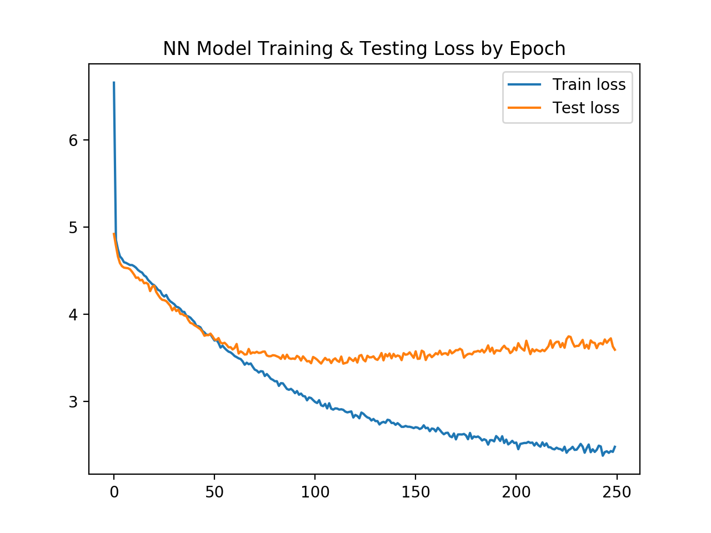
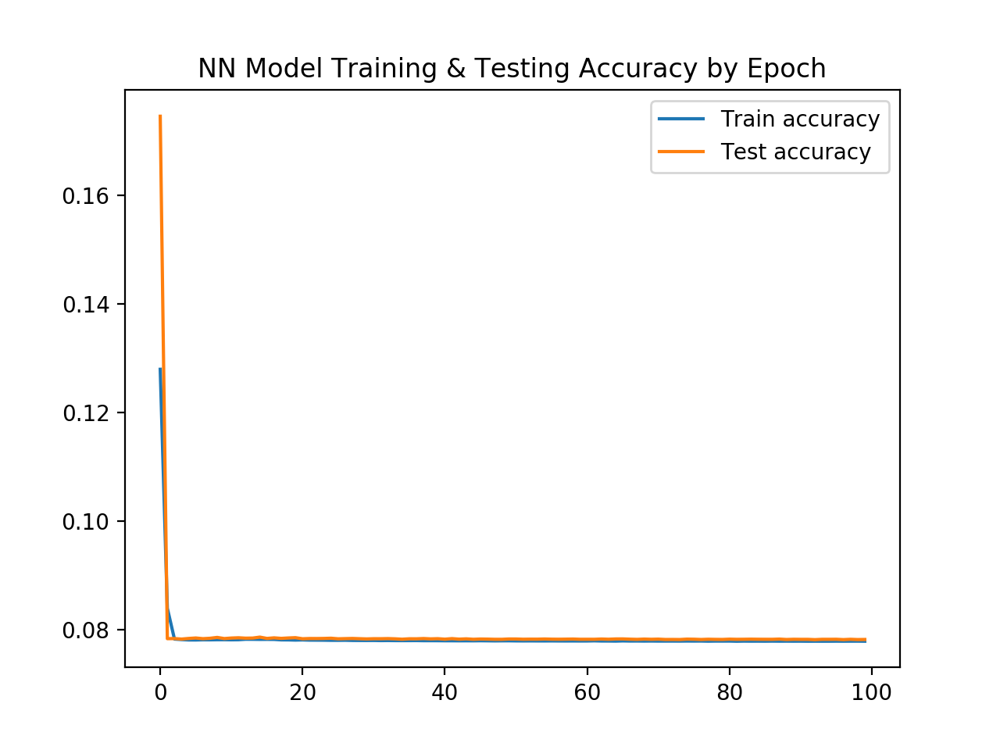

# Technical Report - Kaggle's Freesound Audio Tagging Competition

## Problem Statement

Audio signal processing is a very complex field with many applications, ranging
from automated voice detection (Siri) to music recognition (Shazam). Freesound
has launched a competition, using the Kaggle platform, to build a model that can
train on both clean and noisy sound samples to be able to predict and classify
what new sounds it reads may be.

The challenge here will be figuring out how best to transform incoming audio
signals and how best to model on those transformations to best make these
predictions.

## Data Collection

The data was collected directly from 
[Kaggle](https://www.kaggle.com/c/freesound-audio-tagging-2019/data) using their
API and downloaded to an AWS EFS instance. This EFS instance was mounted to a
t2.micro AWS EC2 instance where all of the processing was completed.

## Exploratory Data Analysis

The dataset contained three sets of sound files, broken into a curated set, a 
noisy set, and a sample set. Each of the sound files range from about a third of 
a second to thirty seconds in length.
 
The curated set contained 4,970 sound clips. The noisy set contained 19,815
sound clips. Each of these sets were labelled in an included file in .csv
format. I chose not to deal with the sample set of files as these were not
labelled and as such, were not helpful for my analysis.

The labels cover a broad array of different categories of sounds, including
voices, knocking, typing, purring, barking, farting, rain, glass shattering, 
musical instruments, bells, etc. There are 80 types of sounds in total. The 
majority of the sounds are multi-labelled, and the noisy dataset includes 
background noises as well.  

### Comparing Wave Signals

To look at the wave files graphically, I used the *wave* library. This library
allowed me to read in the signals' amplitudes and enumerate them according to 
their frame rates for plotting purposes.

Here is an example of a fart sound from the curated set. It only includes the
fart noise without any background noises and thus provides a clean signal to 
process.

.png)


The next two examples show different examples from the noisy set. As you can
see, the background noise makes it very hard to isolate the signal and make any
sense of the sound graphically. The first one is an example of a motorcycle
and the second of a simple raindrop.

.png)

.png)

It is clear that just looking at the amplitudes of the wave signals for each of
the sounds will not be enough to distinguish between similar sounds, especially
those with background noise in the file.

### Other Sound-Related Parameters

I also looked at the parameters of the wave files to get a sense of the types
of information I could gain from each sample. All of the sounds have a single
channel and a framerate of 44100. The number of frames vary based on the length
of the file and none of them are compressed.

###### code sample
```python
f = wave.open('../data/train_curated/0019ef41.wav')
print(f.getparams())
f.close()
```
###### output
```python
_wave_params(nchannels=1, sampwidth=2, framerate=44100, nframes=90616, comptype='NONE', compname='not compressed')
```

Based on this information, I decided a more complex breakdown of the sound
signals would be necessary to conduct any meaningful analysis. 

## Pre-Processing

### Sound Samples

I processed the sounds samples for modeling using three different methods:
1. amplitudes from the raw signals,
2. Fourier transformations to decompose the signals into their constituent frequencies, and
3. Mel-frequency cepstral coefficients (MFCCs).

The first two methods did not offer much in help in terms of a strong variance
between varying sound signals. Hence, I decided to pre-process my samples using
MFCCs for modeling.

MFCCs are derived as follows (via [Wikipedia](https://en.wikipedia.org/wiki/Mel-frequency_cepstrum)):
1. Take the Fourier transform of (a windowed excerpt of) a signal.
2. Map the powers of the spectrum obtained above onto the mel scale, using triangular overlapping windows.
3. Take the logs of the powers at each of the mel frequencies.
4. Take the discrete cosine transform of the list of mel log powers, as if it were a signal.
5. The MFCCs are the amplitudes of the resulting spectrum.

The MFCCs essentially represent the short-term power spectrum of the sound 
signal. The MFCCs for each sound sample showed a significant variance between
samples and thus were better suited for modeling purposes.

To perform the transformations, I relied on the *librosa* library. I processed
the entire dataset, curated and noisy, parsing each with 20, 40, and 60 MFCCs.

### Labels

The labels were not initially given in a user-friendly format. They were given
as a single column in the CSV file, with commas separating multi-labelled
samples. I converted these labels to a sparse matrix, consisting of 80 columns
of 0s and 1s, with multiple 1s representing multi-labelled sound files.

## Modeling

I opted to use a Sequential Neural Network (SNN) to perform the modeling on the
transformed sound files. I conducted all of the modeling on an t2.micro AWS EC2 
instance with an EFS instance mounted to it.

### Strategy

#### Single-Labelled Modeling

I conducted the first models with the labels in their original form, treating
the comma-separated multi-labels as a single label. I removed samples without
duplicate labels and ran them through an SNN to see how well they performed this
way. Yes, this was cheating, as it was not returning individual sound 
predictions and instead just groups of sounds but I thought it was worth seeing
the results.

After lots of trial and error and fine-tuning, this is the SNN that yielded the
best results:
```python
model = Sequential()

model.add(Dense(256, activation='relu', input_shape=(60,)))

model.add(Dense(256, activation='relu',))
model.add(Dropout(0.5))

model.add(Dense(64, activation='relu',))
model.add(Dropout(0.5))

model.add(Dense(64, activation='relu',))
model.add(Dropout(0.5))

model.add(Dense(256, activation='relu',))

model.add(Dense(num_labels, activation='softmax'))

model.compile(loss='categorical_crossentropy',
              metrics=['accuracy'],
              optimizer='adam')
```

I ran this SNN with all of my MFCC transformations, using 20, 40, and 60 MFCCs.
The best performing transformation by far was the one with 40 MFCCs. Here are
the graphs showing the accuracy and loss metrics over each training epoch.




The results were not bad! I got to about 22% accuracy before the model started
overfitting. But remember, we are cheating here. I expected the model to perform 
much worse once we start using the multi-labelled sparse matrix.

#### Multi-Labelled Modeling

The next step was to conduct the modeling using the multi-labelled sparse
matrix. I had to make a few changes to the SNN such as the activation function
for the output layer and the associated loss function, as I'd be returning a 
a binary 1 or 0 for each label in the resulting matrix.
```python
model = Sequential()

model.add(Dense(256, activation='relu', input_shape=(40,)))

model.add(Dense(256, activation='relu',))
model.add(Dropout(0.5))

model.add(Dense(64, activation='relu',))
model.add(Dropout(0.5))

model.add(Dense(64, activation='relu',))
model.add(Dropout(0.5))

model.add(Dense(256, activation='relu',))

model.add(Dense(num_labels, activation='sigmoid'))

model.compile(loss='sigmoid',
              metrics=['accuracy'],
              optimizer='adam')
```

This did not go well at all. The loss function could not measure the model's
performance correctly because with a sparse matrix containing 80 labels, there'd
always be at least 78 true negatives (TNs), making it over 98% accurate even
with a random guess. the resulting graphs so just how hard of a time the model
had.




#### Customized Multi-Labelled Modeling

The next step was to customize the previous SNN to allow the model to train on
each label independently, using accuracy for each, and using precision to 
determine its overall success instead of accuracy, since precision does not take
into account TNs.

As this will be my production model for the time being, the results are
discussed in the following 'Results' section. 

### Results

After all of the modeling with the various transformations, here is a summary
of the useful metrics.

| Model                 | Accuracy  | Precision |
| --------------------- |:---------:| ---------:|
| baseline              | .002      | .002      |
| SNN (single-labelled) | .224      | n/a       |
| SNN (multi-labelled)  | n/a       | .003      |
| SNN (custom)          | n/a       | .055      | 

While 5.5% precision is not a result worth bragging about, it is 27.5 times
better than the baseline. This means we are at least moving in the right
direction.

Finally, I wanted to see which sounds preformed the best in my custom 
multi-labelled model and which performed the worst.

The top 10 sounds my model was able to predict are in the plot below.


The worst 10 sounds my model was able to predict are in the plot below.


The top and worst performing sounds seem to make sense. The best performing are
very distinct sounds while the worst performing have many competing sounds that
are very similar in nature, such as determining the difference between a woman's 
and a child's voice.

## Future Steps

1. **Improve Loss Function** - There is reason to believe that a better
performing loss function will result in the model performing better on each
successive run.

2. **Different Transformations** - There are many more ways to transform sounds
and conduct signal processing. We could apply different techniques here and even
combine different types to see if they perform better in our models. 